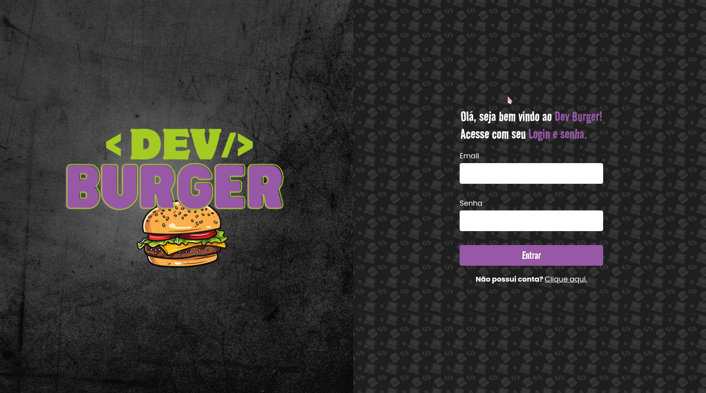
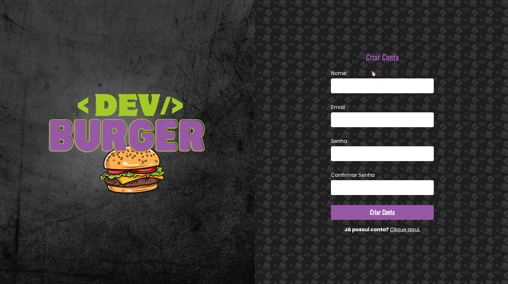
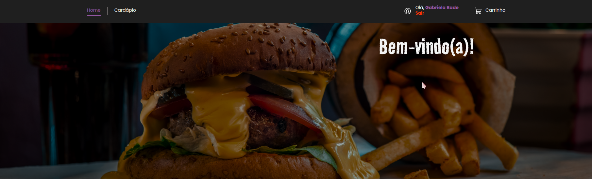
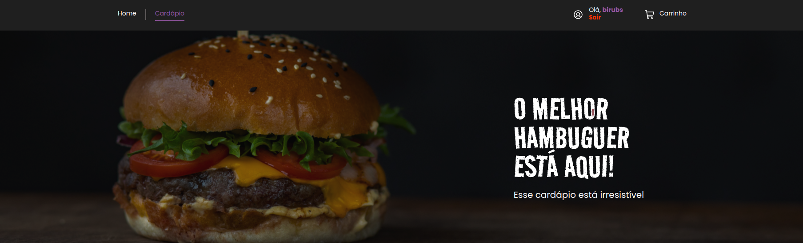
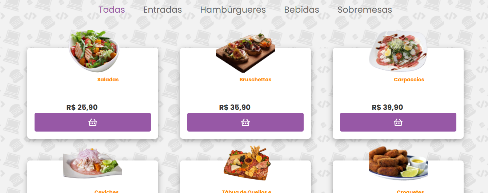
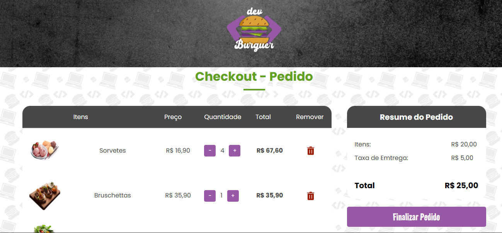

# DevBurger Frontend

Este é o repositório do **Frontend** do projeto **DevBurger**, desenvolvido utilizando React.js, Vite, e Styled-Components.

## Preview do Projeto

### Tela de Login  


### Tela de Cadastro  


### Página Inicial  
  


### Cardápio  



### Carrinho e Resumo do Pedido  


---

## Tecnologias Utilizadas

- React.js  
- Vite  
- Styled-Components  

---

## Configuração do Ambiente

1. Clone o repositório:  
   ```bash
   git clone https://github.com/gabrielabade/devburger-interface
   ```  
2. Acesse a pasta do projeto:  
   ```bash
   cd devburger-interface
   ```  
3. Instale as dependências:  
   ```bash
   yarn install
   ```  
4. Execute o projeto:  
   ```bash
   yarn dev
   ```  

---

## Navegação para o Backend

O repositório do backend pode ser encontrado aqui:  
[DevBurger Backend](https://github.com/gabrielabade/devburger-api)
